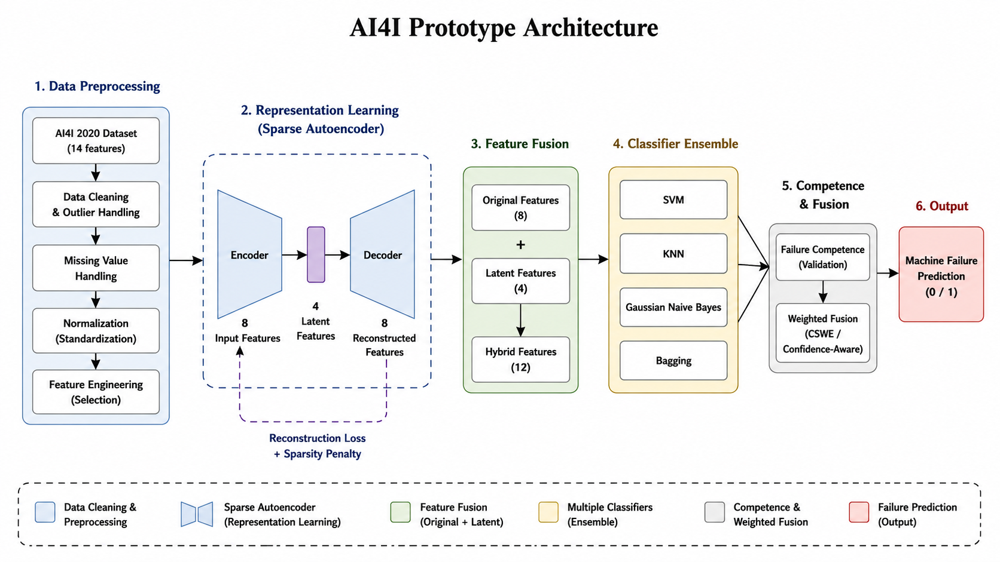
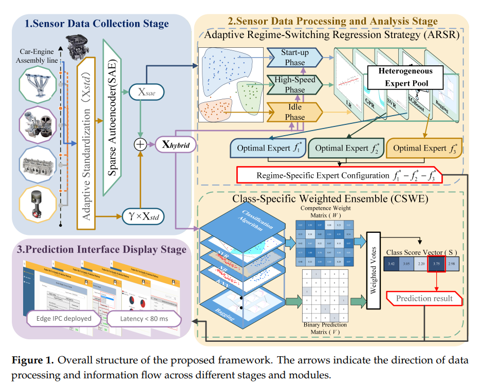
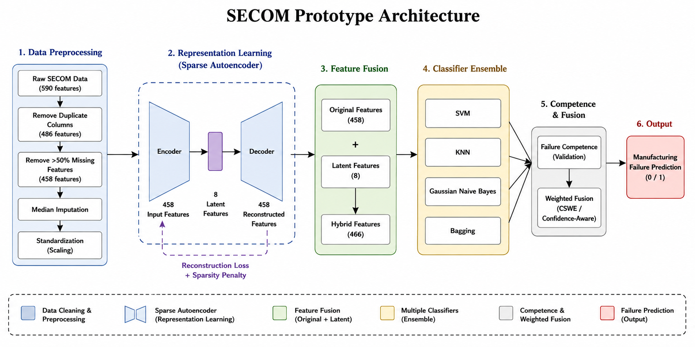
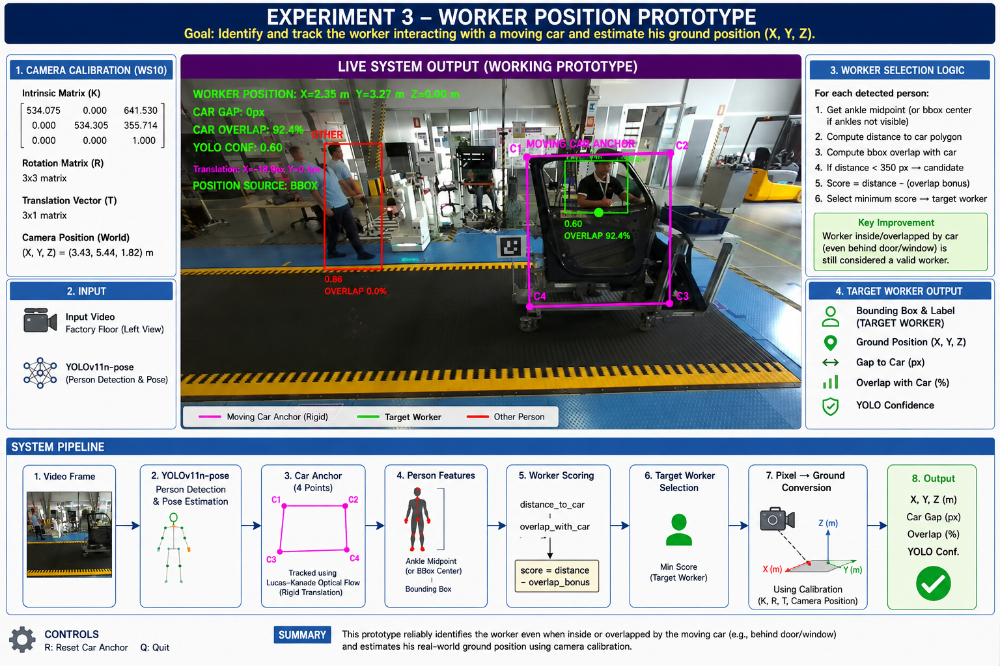
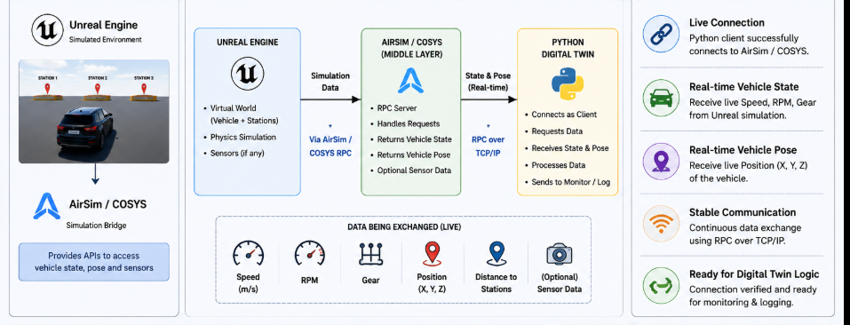
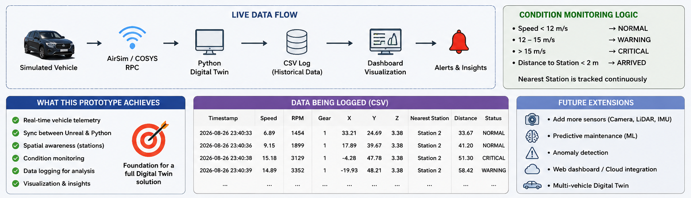
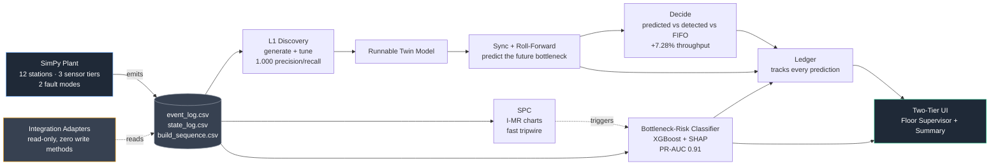

# Accenture-Innovation-Challenge---2026---Team---IITK---AEUAS

# Digital Twin – Controlled Experiments and Prototype Development

This repository contains the controlled experiments and prototype development carried out as part of the Digital Twin research project.

The work is organized into three experimental stages:

1. **Experiment 1 – AI4I**
2. **Experiment 2 – SECOM**
3. **Experiment 3 – carDA / Worker Position Prototype**

A fourth section documents the **planned simulation and Digital Twin integration** using Unreal Engine and AirSim/COSYS.

---

## 1. Papers and Datasets Used as Reference

The experiments were developed by studying relevant research papers and using their datasets/proposed ideas as references.

### Reference Approach

The main ideas investigated across the experiments include:

- Sparse Autoencoder (SAE) based representation learning
- Original + latent feature fusion
- Multiple classifier ensembles
- Bagging and boosting based approaches
- Competence-aware / confidence-aware classifier fusion
- Class-Specific Weighted Ensemble (CSWE)
- Digital Twin integration
- Real-time perception and worker/vehicle state estimation

> **Note:** The referenced papers are used as methodological inspiration. The implementations in this repository are prototype implementations developed for the controlled experiments.

### Datasets

| Experiment | Dataset | Purpose |
|---|---|---|
| Experiment 1 | AI4I 2020 Predictive Maintenance Dataset | Machine-failure prediction prototype |
| Experiment 2 | SECOM Semiconductor Manufacturing Dataset | Manufacturing failure prediction and robustness experiments |
| Experiment 3 | carDA / factory-floor video data | Worker detection, worker selection and ground-position estimation |

---

# 2. Controlled Experiments

## Experiment 1 – AI4I

### Objective

The first controlled experiment investigates a predictive-maintenance pipeline using the **AI4I 2020 dataset**.

The objective was to reproduce and test the main ideas of the selected reference methodology, particularly:

- Data preprocessing
- Sparse Autoencoder representation learning
- Latent feature extraction
- Original + latent feature fusion
- Multiple classifiers
- Ensemble prediction
- Competence/confidence-aware fusion
- Final machine-failure prediction

### Architecture



### Reference Architecture / Paper Concept



The reference methodology provided the main conceptual basis for the architecture. In particular, the experiment investigated the use of:

- Sparse Autoencoder based latent representations
- Feature fusion
- Multiple heterogeneous classifiers
- Bagging / boosting style ensemble concepts
- Competence-aware weighted fusion
- Final binary failure prediction

### Experimental Pipeline

```text
AI4I 2020 Dataset
        ↓
Data Cleaning / Preprocessing
        ↓
Sparse Autoencoder
        ↓
Latent Features
        ↓
Original + Latent Feature Fusion
        ↓
Multiple Classifiers
        ↓
Competence / Confidence Evaluation
        ↓
Weighted Ensemble Fusion
        ↓
Machine Failure Prediction
```

### Implementation

The experiment code is available under:

```text
Controlled Experiments/
└── Experiment 1 - ai4i/
```

The experiment contains the preprocessing, representation-learning, classifier and ensemble components used to evaluate the proposed prototype.

### Evaluation Metrics

The experiment was evaluated using classification metrics including:

- Accuracy
- Precision
- Recall
- F1-score
- ROC-AUC
- Confusion Matrix

### Results

| Model / Configuration | Accuracy | Precision | Recall | F1 | ROC-AUC |
|---|---:|---:|---:|---:|---:|
| Baseline | — | — | — | — | — |
| Proposed / Hybrid | — | — | — | — | — |
| Ensemble | — | — | — | — | — |

---

# Experiment 2 – SECOM

### Objective

The second controlled experiment applies the representation-learning and ensemble methodology to the **SECOM semiconductor manufacturing dataset**.

The SECOM dataset contains a large number of manufacturing sensor/process features with missing values and redundant variables. The experiment therefore focused on preprocessing, feature reduction, latent representation learning and ensemble-based failure prediction.

### Dataset

The SECOM experiment used the following data-processing stages:

```text
Raw SECOM Data
      ↓
Duplicate Column Removal
      ↓
Remove Features with >50% Missing Values
      ↓
Median Imputation
      ↓
Standardization
      ↓
Sparse Autoencoder
      ↓
Latent Features
      ↓
Original + Latent Feature Fusion
      ↓
Classifier Ensemble
      ↓
Competence / Weighted Fusion
      ↓
Failure Prediction
```

### Architecture



### Experimental Components

The experiment investigated:

- SECOM data preprocessing
- Duplicate-feature removal
- Missing-value handling
- Feature standardization
- Sparse Autoencoder representation learning
- Latent feature extraction
- Original + latent feature fusion
- SVM
- KNN
- Gaussian Naive Bayes
- Bagging
- Ensemble prediction
- Competence / weighted fusion

### Controlled Experiments and Ablations

The SECOM study was further divided into controlled experiments to understand the contribution of different components.

#### Experiment 2C – Main Experiment

The main SECOM experiment evaluates the complete prototype pipeline.

```text
SECOM
 ↓
Preprocessing
 ↓
SAE
 ↓
Hybrid Features
 ↓
Classifier Ensemble
 ↓
Weighted / Competence-Aware Fusion
 ↓
Failure Prediction
```

#### Experiment 2D – Ablation

An ablation experiment was performed to investigate the effect of removing selected components from the complete system.

```text
Complete Model
      ↓
Remove / Modify Selected Component
      ↓
Retrain / Evaluate
      ↓
Compare Performance
```

#### Experiment 2E – Latent Feature Ablation

The latent representation contribution was separately investigated by comparing configurations with and without the learned latent features.

```text
Original Features
       vs.
Original + SAE Latent Features
       ↓
Classifier / Ensemble Evaluation
```

#### Threshold Experiment

Different decision thresholds were also investigated to understand the effect of the classification threshold on the final prediction performance.

### Implementation

The experiment code is available under:

```text
Controlled Experiments/
└── Experiment 2 - secom/
```

The folder contains the main experiment, ensemble implementation, preprocessing, SAE representation learning, ablation studies and threshold experiment.

### Evaluation Metrics

The SECOM experiments were evaluated using:

- Accuracy
- Precision
- Recall
- F1-score
- ROC-AUC
- Confusion Matrix

### Results


| Experiment / Configuration | Accuracy | Precision | Recall | F1 | ROC-AUC |
|---|---:|---:|---:|---:|---:|
| Main SECOM | — | — | — | — | — |
| Ensemble | — | — | — | — | — |
| Ablation | — | — | — | — | — |
| Latent Ablation | — | — | — | — | — |
| Threshold Experiment | — | — | — | — | — |

---

# Experiment 3 – carDA / Worker Position Prototype

## Objective

The third controlled experiment moves from tabular predictive-maintenance data to a **real-time computer-vision prototype for worker safety and spatial awareness**.

The objective is to identify and track the worker interacting with a moving car and estimate the worker's ground position:

```text
(X, Y, Z)
```

The prototype is designed to remain useful even when the worker becomes partially occluded by the vehicle, including situations where the worker is visible through or behind the car door/window.

### Prototype Architecture



### Input

The prototype uses a factory-floor video captured from the **WS10 camera view**.

Person detection and pose estimation are performed using:

```text
YOLOv11n-pose
```

### Camera Calibration

The worker's image position is converted to a ground/world position using camera calibration parameters:

- Intrinsic camera matrix `K`
- Rotation matrix `R`
- Translation vector `T`
- Camera world position

The ground plane is assumed to be:

```text
Z = 0
```

The detected worker pixel position is projected onto this ground plane to estimate the real-world worker position.

### Moving Car Tracking

The car is represented using four manually selected anchor points:

```text
C1 ───────── C2
│             │
│     CAR     │
│             │
C4 ───────── C3
```

The four anchor points are tracked using **Lucas–Kanade optical flow**.

A common translation is estimated from the tracked points so that the car maintains a rigid shape during motion.

### Worker Selection Logic

For every detected person:

1. Obtain the ankle midpoint when reliable.
2. Use the bounding-box center as a fallback when ankle information is unavailable.
3. Calculate the distance from the person to the moving car polygon.
4. Calculate bounding-box overlap with the car polygon.
5. Reject people farther than the worker-selection distance threshold.
6. Calculate a worker score.
7. Apply an overlap bonus when the person overlaps the car.
8. Select the person with the minimum score as the target worker.

Conceptually:

```text
Worker Score
=
Distance to Car
-
Overlap Bonus
```

This allows a worker who is very close to or partially inside the moving-car region to remain a valid worker candidate.

### Important Prototype Capability

A key observation from the experiment is that a person can become heavily overlapped by the moving car while still being the relevant worker.

For example:

```text
Worker outside car
       ↓
Worker approaches car
       ↓
Worker overlaps car region
       ↓
Worker becomes partially occluded
       ↓
Worker remains selected as TARGET WORKER
       ↓
Ground position is estimated
```

This is important for the intended worker–vehicle interaction scenario.

### Prototype Output

The system provides:

- Target worker bounding box
- Target worker label
- Worker ground position `(X, Y, Z)`
- Distance/gap to moving car
- Worker/car overlap percentage
- YOLO confidence
- Moving car anchor
- Car translation

### Demo Video

The following video demonstrates the working Experiment 3 prototype for worker detection, moving-car tracking, and ground-position estimation.

<p align="center">
  <video
    src="https://github.com/user-attachments/assets/1aae6dc8-ef19-4a69-bcbd-ae2d84fd1d8f"
    controls
    width="1000">
  </video>
</p>

---

# 3. Planned Simulation and Digital Twin Integration

The next stage is to connect the perception and Digital Twin components with a simulated environment.

The planned simulation environment uses:

- Unreal Engine
- AirSim / COSYS
- Python Digital Twin client
- Real-time RPC communication
- Vehicle state and pose information
- Monitoring and logging

### Simulation Architecture



The intended communication architecture is:

```text
Unreal Engine
     ↓
AirSim / COSYS
     ↓
Python Digital Twin
     ↓
Real-Time State / Pose
     ↓
Processing / Monitoring
     ↓
Logging / Visualization
```

### Planned Live Data Flow



The simulation is intended to provide real-time vehicle information such as:

- Speed
- RPM
- Gear
- Vehicle position `(X, Y, Z)`
- Distance to stations
- Optional sensor data

The Python Digital Twin will receive and process this information through the simulation interface.

### Planned Monitoring Pipeline

```text
Simulated Vehicle
       ↓
AirSim / COSYS RPC
       ↓
Python Digital Twin
       ↓
Real-Time Vehicle State
       ↓
CSV Logging
       ↓
Dashboard / Visualization
       ↓
Alerts and Insights
```

### Future Direction

The planned simulation stage will provide the foundation for integrating the controlled experiments with a larger Digital Twin framework.

Potential extensions include:

- Real-time perception integration
- Camera / LiDAR / IMU sensor integration
- Worker–vehicle interaction monitoring
- Predictive maintenance integration
- Anomaly detection
- Digital Twin state synchronization
- Multi-vehicle simulation
- Web/cloud-based monitoring

---

Yes — I understand now. You want **one clean Markdown block that you can copy directly into GitHub**, with the image placeholders already included.

Use this exactly:

# 4. LineSight Digital Twin

  

# LineSight

**A digital twin that builds itself from data the plant already collects — predicts the shifting bottleneck by rolling forward over a known build sequence, explains its own reasoning, and tracks whether it was right.**

Accenture Innovation Challenge 2026 · DigitalTwin.ai · Team IITK-AEUAS (Bhaskar Rajaura, Tahseen Aslam), IIT Kanpur

---

## The system 



Everything left of the logs is `plant/` — the "physical" system. Everything right of them is `twin/` — the actual proposal, and it **only ever reads those three files**, never plant internals. That boundary is enforced by directory structure, not convention: `plant/` has zero imports from `twin/`, checkable in the codebase directly.

---

## The problem

On a vehicle assembly line, two failures compound quietly. Line throughput equals the throughput of its slowest station — but on a mixed-model line the constraint shifts as high-option vehicles cluster in the build sequence, and dashboards report this only after output is already lost. Separately, a defect introduced at a manual station goes undetected until end-of-line testing, hours downstream, by which point every vehicle built in between carries the same risk.

Both failures share one cause: the line can observe its current state but cannot anticipate its next one — hardest to fix exactly where it matters most, since general-assembly stations are manual and largely un-instrumented, while body-shop stations are richly monitored.

## What LineSight does

- 🏗️ **Builds itself** — process-mines a plant's MES event log directly into a graph model, no manual modelling, regenerates automatically when the line changes.
- 🎚️ **Models uneven instrumentation explicitly** — every station carries a sensor tier (`instrumented` / `partial` / `manual`) rather than assuming a uniformly-monitored ideal factory.
- 🔮 **Predicts by rolling forward** — synchronises to live state, then simulates ahead over the known upcoming build sequence to locate the constraint before it forms.
- 🤖 **Backs that up with a trained, explainable model** — a bottleneck-risk classifier (XGBoost + SHAP) corroborates the structural prediction with an independently learned signal.
- 📈 **Catches sustained faults fast and cheaply** — statistical process control (I-MR charts) flags mean-shift anomalies with no training required.
- 🎯 **Reports honestly** — ranked candidate causes with confidence, not false certainty; a visible track record of its own past predictions; explicit flags wherever it's inferring rather than observing.
- 🔒 **Never touches the line it watches** — every integration adapter is architecturally read-only, verified by the absence of any write method, not by policy.
- 🌐 **Generalises** — the identical codebase recovers a structurally different line's topology with zero accuracy loss.

## Status

| Layer | Status | Headline result |
|---|---|---|
| Plant simulator | ✅ Built & verified | 12 stations, 3 sensor tiers, 2 fault modes, reliability model |
| L1 — self-building twin | ✅ Built & verified | **1.000 / 1.000** node & arc precision-recall |
| L3 — sync, detect, roll-forward predict | ✅ Built & verified | Predicted beats FIFO by **+7.28%**, 8/8 replications, CI excludes zero |
| SPC (I-MR charts) | ✅ Built & verified | Wear fault flagged **21.1 min** after onset, >10x specificity |
| Bottleneck-risk classifier (XGBoost + SHAP) | ✅ Built & verified | **PR-AUC 0.9105** vs. 0.8806 baseline |
| Defect-risk classifier (Bosch, real data) | ✅ Built & verified | **PR-AUC 0.0284** vs. 0.0039 baseline (7.3×) |
| Read-only integration | ✅ Built & verified | Zero write methods anywhere — checkable, not just claimed |
| Scalability (Site B) | ✅ Built & verified | **Zero accuracy degradation** on a structurally different line |
| Prediction ledger | ✅ Built & verified | Every prediction tracked and resolved against real outcomes |
| Physics-consistency gate (Little's Law) | ✅ Built & verified | Flags forecasts inconsistent with WIP = Throughput × Flow Time |
| Two-tier operator UI | ✅ Built & verified | Live, non-hardcoded; verified via Streamlit's own AppTest framework |
| Vision (low-cost sensing) | ⚠️ Designed & tested standalone, not integrated | Real pipeline, run against real external data (HA4M dataset) |

---

## Results

**Prediction beats detection beats doing nothing** — replicating Ragazzini et al.'s central experiment on our own data, 8 replications, paired comparison excludes zero:

```
FIFO       ███████████░░░░░░░░░░░░░░░░░░░  0.5290 parts/min
Detected   █████████████████░░░░░░░░░░░░░  0.5455 parts/min   (+3.1% vs FIFO)
Predicted  █████████████████████████░░░░░  0.5675 parts/min   (+7.28% vs FIFO, +4.03% vs Detected)
```
*(bars zoomed to the 0.50–0.58 range for visual clarity — all three arms are real, positive throughput)*

**The defect classifier beats its no-skill baseline by 7.3×**, on real external production data (Bosch Production Line Performance, 600k rows):

```
Model      ██████████████████████████████  PR-AUC 0.0284
Baseline   ████░░░░░░░░░░░░░░░░░░░░░░░░░░  PR-AUC 0.0039
```

**SPC flags the sustained fault with overwhelming specificity** — two orders of magnitude above every unaffected station:

```
Station 7 (wear fault)    ██████████████████████████████  3,942 flags
Every other station (max) █░░░░░░░░░░░░░░░░░░░░░░░░░░░░░  126 flags
```

**Scalability, demonstrated** — Site B (18 stations, 15/18 manual-tier) vs. Site A (12 stations, 6/12 manual-tier):

| | Site A | Site B |
|---|---|---|
| Node precision / recall | 1.000 / 1.000 | 1.000 / 1.000 |
| Arc precision / recall | 1.000 / 1.000 | 1.000 / 1.000 |
| Buffer capacity MAE | 1.00 | 1.00 |
| Manual-tier proportion | 6/12 (50%) | 15/18 (83%) |

Identical accuracy despite a much less-instrumented line — the same codebase, zero edits, because discovery only needs MES timestamps, which every station produces regardless of sensor tier.

**The business case, computed from this project's own results, not asserted separately:**

| | |
|---|---|
| Annual savings (illustrative) | **$2,332,754** |
| One-time rollout cost | **$3,750** |
| Payback period | **~0.02 months** (see *Honest findings* — this is fast for a real, explained reason) |

---

## Architecture

```
plant/    the "physical" system. SimPy. Emits logs. Nothing else may import it.
twin/     everything actually being proposed. Reads logs only.
```

`plant/` stands in for a real assembly line — a calibrated simulator playing the role of what Ait-Alla et al. and Ragazzini et al. (2024) call the **Physical Twin**, the same construct used to generate the dataset in Waseem et al.'s General Motors study. `twin/` consumes only `event_log.csv`, `state_log.csv`, and `build_sequence.csv` — never anything internal to the simulator, exactly the constraint a real deployment faces too.

```
linesight/
├── plant/          the synthetic Physical Twin (SimPy)
├── twin/
│   ├── discovery/  L1 -- self-building twin (Lugaresi & Matta)
│   ├── sync/       state reconstruction + roll-forward prediction
│   ├── bottleneck/ active period + turning point methods
│   ├── spc/        I-MR control charts, Western Electric rules
│   ├── ai/         bottleneck-risk classifier (XGBoost + SHAP)
│   ├── decide/     the experiment controller (predict vs. detect vs. FIFO)
│   ├── forecast/   Little's Law physics-consistency gate
│   └── ledger.py   prediction tracking, resolved against outcomes
├── integration/    read-only adapters (zero write methods, verified)
├── defect/         Bosch defect-risk classifier (real external data)
├── vision/         low-cost sensing for un-instrumented stations
├── app/            the two-tier operator UI (Streamlit)
├── config/         line configs, including a structurally different Site B
└── tests/          every acceptance test in this README, runnable directly
```

---

## Reproduction from scratch

### (Reproduce this from scratch, on a brand new machine)

Assumes a blank Windows machine with nothing installed. Adjust package-manager commands if you're on Mac/Linux — everything else is identical.

### 1. Install the tools

- **Miniconda** -- [docs.conda.io/miniconda](https://docs.conda.io/en/latest/miniconda.html), default install options are fine.
- **Git for Windows** -- [git-scm.com](https://git-scm.com/), default install options are fine.
- **VS Code** (optional but recommended) -- [code.visualstudio.com](https://code.visualstudio.com/), with the Python extension.

### 2. Clone and set up the environment

```powershell
git clone https://github.com/mdttech/linesight.git
cd linesight

conda create -n linesight python=3.11 -y
conda activate linesight

python -m pip install --upgrade pip
pip install -r requirements.txt
```

Verify:
```powershell
python -c "import simpy, numpy, pandas, networkx, streamlit, sklearn, xgboost, shap, torch; print('all core imports ok')"
```

### 3. Run every phase, in order

```powershell
# Phase 1 -- plant simulator
python -m plant.run --config config/line_siteA.yaml --out plant_out --seed 42
python tests/test_bottleneck_formation.py
python tests/test_faults.py

# Phase 2 -- L1 self-building twin
python tests/test_discovery_accuracy.py
python tests/test_tune_unit.py
python tests/test_discovery_throughput.py
python tests/test_discovery_reconfigure.py

# Phase 3 -- sync, detect, roll-forward predict
python tests/test_active_period.py
python tests/test_turning_point.py
python tests/test_rollforward.py
python tests/test_predict_vs_detect_experiment.py

# Phase 4 -- the AI layer
python tests/test_ai_training_data.py
python tests/test_bottleneck_classifier.py

# Phase 6 -- SPC
python tests/test_spc.py

# Phase 7 -- integration + scalability
python tests/test_integration_readonly.py
python tests/test_siteB_discovery.py

# Phase 9 -- ledger, physics check, UI data layer
python tests/test_ledger.py
python tests/test_physics_check.py
python tests/test_ui_data.py
```

Every run is seeded -- the same seed on the same code reproduces identical output on any machine. If any script's output doesn't match this README's results table exactly, something about the environment or the code differs from what's described here.

### 4. Launch the live UI

```powershell
streamlit run app/app.py
```

Opens automatically in your browser. Move the "Simulated time" slider to `2000` for the strongest demo moment -- the classifier locking onto the true wear-fault station at 98%+ confidence.

### 5. Optional: the two phases needing external data

**Phase 5 (defect classifier)** needs the Bosch Production Line Performance dataset from Kaggle -- not included in this repo (too large, and not ours to redistribute). Download `train_numeric.csv` and `train_date.csv`, edit the path at the top of `defect/bosch_pr_auc.ipynb`, run all cells.

**Phase 8 (vision, designed but not integrated)** needs a copy of the HA4M dataset (Cicirelli et al., 2022) or similar assembly-action video/frame data -- also not included. `vision/inspect_data.py` and `vision/frame_classifier.py` are ready to point at a real copy if you want to pick this up.

---

## Findings

### (Honest findings -- reported, not smoothed over)

**Buffer capacity discovery is off by exactly +1, on every edge, always.** A station that finishes a part but is blocked from releasing it gets recorded as "entered the buffer" at its finish timestamp, before it has actually landed there -- a real, bounded, fully-explained characteristic of estimating occupancy from MES timestamps rather than internal telemetry (the same constraint a real deployment faces).

**The regenerated model's throughput runs ~13% higher than the true plant's.** The discovered processing-time distribution is pure `(finish - start)`, which correctly excludes downtime -- so the regenerated model doesn't yet inherit the true plant's reliability losses. A legitimate, well-scoped next step, not attempted this round.

**SPC is specifically good at mean-shift faults, not variance-only ones.** The wear fault (a sustained mean shift) is caught with overwhelming specificity; the operator-variation fault (variance-only, time-windowed) shows flag counts within the normal range of unaffected stations. This is exactly why SPC, the roll-forward prediction, and the trained classifier are complementary -- each catches what the others structurally can't.

**The prediction ledger's exact-station match rate (~30-40%) is lower than the classifier's confidence numbers alone might suggest -- and that's expected, not a contradiction.** The roll-forward mechanism's documented simplification (restarting mid-cycle stations with fresh draws rather than exact remaining-time tracking) introduces real per-snapshot noise. What actually matters -- and what the controlled 8-replication experiment measured -- is whether *acting* on these predictions improves real throughput, and it does, in every replication. A near-miss prediction still gives useful early warning.

**The business case's sub-day payback is real, not a rounding artifact -- and worth explaining, not just stating.** Throughput value dominates the total (84% of annual savings) against a deliberately small one-time cost, because this is a low-capex software-and-sensing rollout on an *already-existing* line, not a new production line. Verified robust to a much more conservative throughput-value assumption too (78% lower still gives payback under two days).

**Vision was designed, built, and tested against real external data -- and deliberately not integrated into the live demo.** `vision/inspect_data.py` and `vision/frame_classifier.py` implement a frozen-backbone (ResNet18) classifier over a linear head, run against real frames from the HA4M dataset (Cicirelli et al., *Scientific Data* 9, 745, 2022) -- a genuine industrial assembly-action dataset, not a synthetic stand-in. Two real bugs were found and fixed while building this (a directory-traversal error in the label finder, and a label-format parser that assumed the wrong file structure before the real format was confirmed). Cut from the final integrated demo for time, not because the mechanism doesn't work.

**The UI is a replay, not a live system**, disclosed directly in the app itself: the plant is simulated once at startup and a time slider moves through that fixed run. A documented, deliberate simplification for a live demo.

---

## The three-view interface

`streamlit run app/app.py` opens a two-tab view built from one shared model, not two separate systems:

- **Floor Supervisor** -- live station states, buffer levels, the current roll-forward prediction, the classifier's independent confidence and SHAP-ranked causes, a Little's Law physics-consistency check, and the prediction ledger's real track record.
- **Summary** -- the business case, computed from this project's own results, and the rollout concept.

## What's next

Wiring the vision pipeline into the live UI as a third data source for un-instrumented stations; incorporating station reliability into the regenerated model's throughput; a fuller multi-causal attribution combining SHAP with Kumbhar et al.'s state-contribution method.


### Read-Only Digital Twin Architecture

The current implementation follows a read-only architecture.

```text
Synthetic / Exported Production Data
              ↓
       Data Processing
              ↓
       Process Discovery
              ↓
      Digital Twin Model
              ↓
     Bottleneck Analysis
              ↓
        Dashboard
              ↓
      Monitoring / Insights
```

The current Digital Twin does not contain a PLC write path. It consumes
production data, maintains a digital representation of the production line,
and provides monitoring and analytical insights.

### Current Capabilities

The implemented LineSight prototype currently demonstrates:

* Production-event ingestion
* Process discovery
* Station-level cycle-time analysis
* Bottleneck identification
* Equipment-degradation analysis
* Sensor-coverage monitoring
* Digital Twin dashboard visualization
* Read-only system monitoring

### Future Direction

The LineSight Digital Twin can subsequently be extended toward real-time
integration with physical or simulated production systems.

Potential extensions include:

* Real-time event streaming
* Live equipment-state synchronization
* Predictive maintenance
* Anomaly detection
* Remaining useful life estimation
* Additional sensor integration
* Automated maintenance alerts
* Historical trend analysis
* Cloud-based Digital Twin deployment

---

# Repository Structure

The repository is organized as follows:

```text
DigitalTwin/
│
├── Controlled Experiments/
│   │
│   ├── Experiment 1 - ai4i/
│   │
│   ├── Experiment 2 - secom/
│   │
│   └── Experiment 3 - carDA/
│
├── images/
│   ├── 0.png
│   ├── 1.png
│   ├── 2.png
│   ├── 3.png
│   ├── 4.png
│   └── 5.png
│
└── pose_output.mp4
```

---

# Summary

The project currently progresses through three controlled experimental stages:

```text
Experiment 1
AI4I Predictive Maintenance
        ↓
Representation Learning + Ensemble
        ↓
Experiment 2
SECOM Manufacturing Failure Prediction
        ↓
Ablation + Latent Feature + Threshold Studies
        ↓
Experiment 3
Worker–Vehicle Perception Prototype
        ↓
Worker Detection + Car Tracking
        ↓
Ground Position Estimation
        ↓
Planned Digital Twin Simulation
        ↓
Unreal Engine + AirSim / COSYS + Python
```
---
## References

Lugaresi, G. & Matta, A. (2021). Automated manufacturing system discovery and digital twin generation. *Journal of Manufacturing Systems*, 59, 51-66.

Ragazzini, L., Negri, E., Fumagalli, L. & Macchi, M. (2024). Digital Twin-based bottleneck prediction for improved production control. *Computers & Industrial Engineering*, 192, 110231.

Kumbhar, M., Ng, A.H.C. & Bandaru, S. (2023). A digital twin based framework for detection, diagnosis, and improvement of throughput bottlenecks. *Journal of Manufacturing Systems*, 66, 92-106.

Waseem, M., Tan, C., Oh, S.-C., Arinez, J., Zhou, Z. & Chang, Q. (2026). Spatio-temporal graph neural network based digital twin surrogate for throughput estimation in general assembly lines. *Journal of Manufacturing Systems*, 86, 641-647.

Selvaraj, V., Al-Amin, M., Yu, X., Tao, W. & Min, S. (2024). Real-time action localization of manual assembly operations using deep learning and augmented inference state machines. *Journal of Manufacturing Systems*, 72, 504-518.

Iyer, S.V., Sangwan, K.S. & Dhiraj (2025). A cognitive digital twin for process chain anomaly detection and bottleneck analysis. *Journal of Industrial and Production Engineering*, 42(1).

Cicirelli, G., Marani, R., Romeo, L., Garcia Dominguez, M., Heras, J., Perri, A.G. & D'Orazio, T. (2022). The HA4M dataset: Multi-Modal Monitoring of an assembly task for Human Action recognition in Manufacturing. *Scientific Data*, 9, 745.

Yang, et al. (2025). Leveraging Large Language Models for Enhanced Digital Twin Modeling: Trends, Methods, and Challenges. arXiv:2503.02167.
---
The repository is intended to document the experimental development from **data-driven predictive maintenance**, through **manufacturing-failure experiments**, to **real-time perception and Digital Twin integration**.
